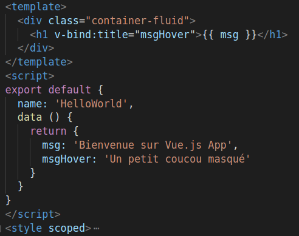

= Débuter avec VueJS

== Pour commencer

=== Utilisation du client vuejs
* Avec npm
[source,shell]
----
# install vue-cli
$ npm install --global vue-cli
# create a new project using the "webpack" template
$ vue init webpack my-project
# install dependencies and go!
$ cd my-project
$ npm run dev
----

=== Intégration bootstrap

* Utilisation de bootstrap-vue
[source,shell]
----
npm i bootstrap-vue
----

* Ajouter dans le fichier *App.vue*

[source,javascript]
----
import Vue from 'vue'
import BootstrapVue from 'bootstrap-vue'

Vue.use(BootstrapVue);
----


=== Intégration bootstrap

* Importer les css dans le fichier *App.vue*
```css
@import 'bootstrap/dist/css/bootstrap.css';
@import 'bootstrap-vue/dist/bootstrap-vue.css';
```


=== Configuration IDE
* Utilisation de **vscode**
* Plugins : 
   * **Vetur**
   * **Vue 2 Snippets**

=== Structure d'un composant
* Fichier de composant *.vue* / decomposé en 3 parties



== Les bases

=== Les 3 parties : 
* *template* uniquement html. 1 seule balise root
* *script* code javascript
* *style* style du composant

== Les directives
* attributs v-
* Nombreuses directives disponibles par VueJS
* Possibilité de developper ses propres directives

=== Directives conditionnels / boucles
* v-if / v-else-if / v-else 
* v-for

=== Directive v-bind
Cette directive permet de lier un attribut à une propriété défini dans la partie __data__. 
Le racourci **:** peut être utilisé à la place de **v-bind**.

== Déclarer un nouveau composant